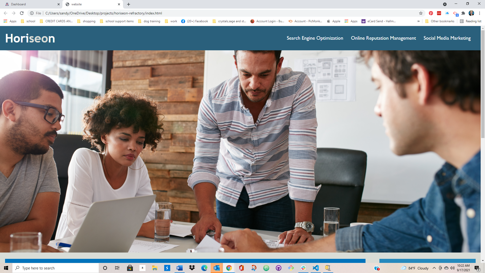

# Horiseon-Refractory

Description

 This is a short, simple description of a feature told from the perspective of the person who is requesting the new capability, usually a user or customer of the system. This follows an AS AN / I WANT / SO THAT format. For example, "AS A shopper visiting an online store, I WANT to place items in a shopping cart, SO THAT I can purchase them."

  This is a short, simple description of a feature told from the perspective of the person who is requesting the new capability, usually a user or customer of the system. This follows an AS AN / I WANT / SO THAT format. For example, "AS A shopper visiting an online store, I WANT to place items in a shopping cart, SO THAT I can purchase them."

  Web accessibility is an increasingly important consideration for businesses. It ensures that people with disabilities can access a website using assistive technologies such as video captions, screen readers, and braille keyboards. Making a website accessible is also good for business for many reasons, one of them being that accessible sites are better positioned in search engines like Google. It also helps companies avoid litigation that can occur when people with disabilities can't access their website.

Even though accessibility is a broad topic that can include complex requirements, your tech lead has given you a small list of specific criteria to satisfy the project. These criteria are documented in the Acceptance Criteria section.

Installation
Open Web page as normal

Usage

Credits

Sandra Sanders

License
 This is free and unencumbered software released into the public domain.

Anyone is free to copy, modify, publish, use, compile, sell, or
distribute this software, either in source code form or as a compiled
binary, for any purpose, commercial or non-commercial, and by any
means.

In jurisdictions that recognize copyright laws, the author or authors
of this software dedicate any and all copyright interest in the
software to the public domain. We make this dedication for the benefit
of the public at large and to the detriment of our heirs and
successors. We intend this dedication to be an overt act of
relinquishment in perpetuity of all present and future rights to this
software under copyright law.

THE SOFTWARE IS PROVIDED "AS IS", WITHOUT WARRANTY OF ANY KIND,
EXPRESS OR IMPLIED, INCLUDING BUT NOT LIMITED TO THE WARRANTIES OF
MERCHANTABILITY, FITNESS FOR A PARTICULAR PURPOSE AND NONINFRINGEMENT.
IN NO EVENT SHALL THE AUTHORS BE LIABLE FOR ANY CLAIM, DAMAGES OR
OTHER LIABILITY, WHETHER IN AN ACTION OF CONTRACT, TORT OR OTHERWISE,
ARISING FROM, OUT OF OR IN CONNECTION WITH THE SOFTWARE OR THE USE OR
OTHER DEALINGS IN THE SOFTWARE.

For more information, please refer to <https://unlicense.org>

DEPLOYED LINK
https://sandy-06.github.io/Horiseon-Refractory/

GitHub Link
https://github.com/sandy-06/Horiseon-Refractory
